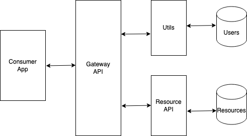
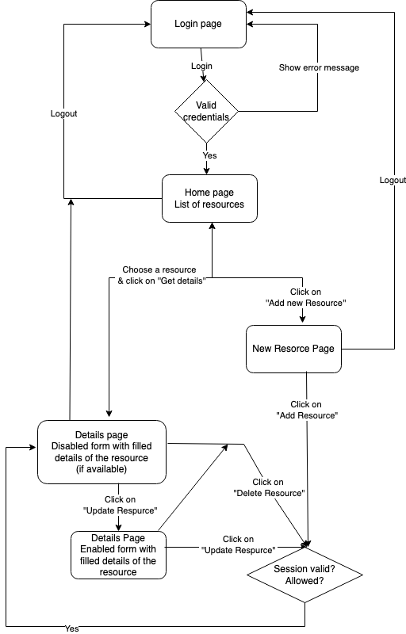

## Design

### Architecture


### Resource API
Resource API can be used to manipulate resource data using CRUD operations.
It is developed using Fast API. 
Currently data is stored in a local dictionary variable. Resource id is used as key to access resource information.

### Gateway API
Gateway API authenticates and authorises usage of underlying APIs. 
It is also developed using Fast API.
Gateway is responsible for following tasks in current implementation:
- Generate tokens for valid users
- Checks token validity
- Forward calls to API if the user provides a valid token

The gateway consists of 3 users with different rights as described below:

| Username  |  Password  |      Rights           |        Operation         |       Remarks           |
|-----------|:----------:|:---------------------:|:------------------------:|:-----------------------:|
| johndoe   |   secret   | read                  | get                      | User can only read      |
| janedoe   |   secret   | read, write           | get, post, put           | User can read & write   |
| admin     |   secret   | read, write, delete   | get, post, put, delete   | User can do everything  |

### Consumer Application
Consumer application provides a user interface to access and modify resource data.
It is developed using Flask.



## API documentation (provided by Swagger UI)
>info: Please note these documentation will be available only once the server is running.

### Resource API
```
http://127.0.0.1:8282/docs
```

### Gateway API
```
http://127.0.0.1:8484/docs
```

## Improvements
- Enable HTTPS
- Integrate database and storage for storing data.
- Logging - integrate with Splunk | store logs to file 
- Functionality of adding/removing users can be added
- Show only allowed functionality in UI based on user scope
- Gateway can be enhanced for rate limiting, load balancing, etc